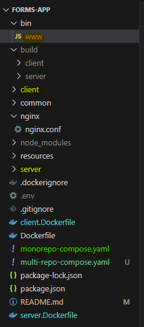
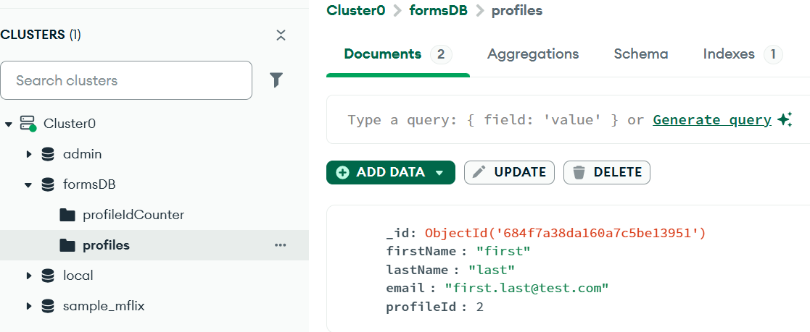
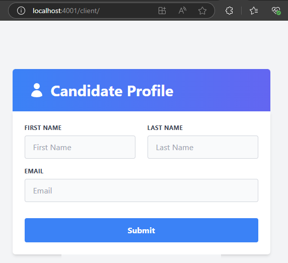
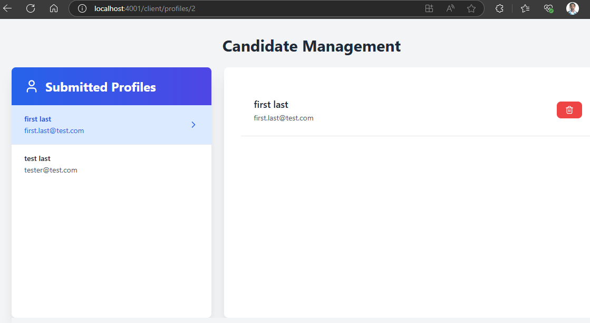
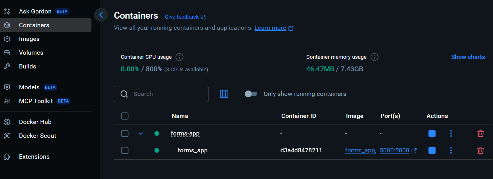
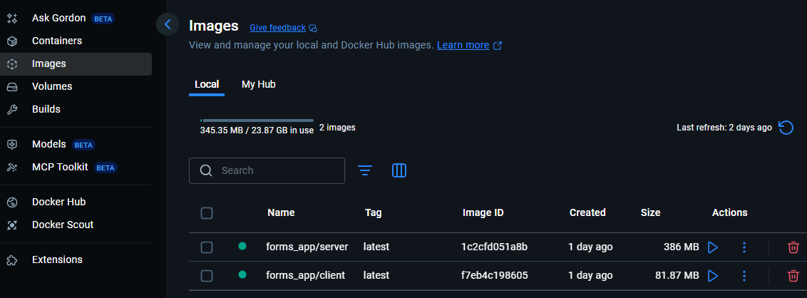
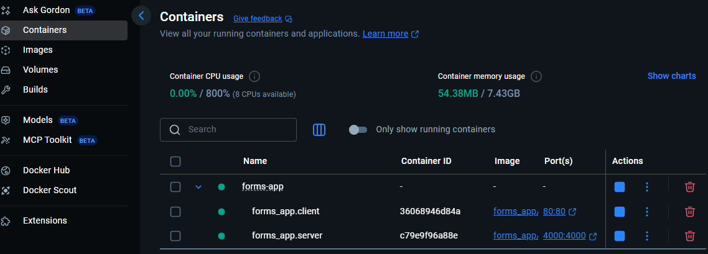

<h1 align="center"># Profile Management App (Monorepo / Multi-repo)</h1>

This project is a full-stack application for managing user profiles. It consists of a React frontend for users to submit their details and for administrators to manage profiles, and an Express.js backend API to handle data operations and serve the frontend. Major codebase is written in TypeScript.

## Features

*   **User Profile Submission:** A user-friendly form for users to enter and submit their profile information.
*   **Admin Profile Management:**
    *   View a list of all submitted user profiles (`/profiles`).
    *   View / delete detailed information for a selected user (`/profiles/:profileId`).
    *   (Future: Edit profiles).
*   **Backend API:** Secure RESTful API endpoints for data interaction.
*   **MongoDB Atlas Integration:** Data is persisted in a cloud-hosted MongoDB Atlas database.
*   **Auto-Incrementing Profile ID:** A MongoDB Atlas database trigger function handles the auto-incrementing `profileId` sequence for new profiles.
*   **TypeScript End-to-End:** Ensures type safety and improves developer experience across both frontend and backend.
*   **TailwindCSS Styling:** Modern and utility-first CSS framework for styling the React frontend.
*   **Mono / Multi repo Structure:** The code is structured in a way to leverage deploying the application either as a monorepo as well as multi-repo, with a shared `common` package for TypeScript types.

## Tech Stack

*   **Frontend:**
    *   React (Create React App)
    *   TypeScript
    *   TailwindCSS
    *   React Router
*   **Backend:**
    *   Node.js
    *   Express.js (Express Generator)
    *   TypeScript
    *   MongoClient (for MongoDB interaction)
*   **Database:**
    *   MongoDB (Cloud Atlas)
*   **Shared:**
    *   TypeScript (for common types/interfaces in the `packages/common` workspace)
*   **Development Tools:**
    *   NPM Workspaces for monorepo management & Concurrently running multiple services
*   **Hosting & Deployment:**
    *   Containarized approach to build, deploy and host the application in Docker, leveraging nginx

## Project Structure
<p align="center">
    
</p>

## Prerequisites

*   Node.js (LTS version recommended, e.g., v18.x or v20.x)
*   Yarn (v1 or v3+) or npm (v7+)
*   MongoDB Atlas Account
*   Docker Engine (such as Docker Desktop)

## Getting Started

### 1. Clone the Repository

```bash
git clone forms-app
cd forms-app
```

### 2. Install dependencies
```bash
npm install 
```

### 3. Setup environment variables in .env
*   You'll need to create .env files for both the client and server applications for running the app locally.

*   Client environment file (forms-app/client/.env)
```bash
# Environment variables for the forms application
# Below variables are part of cra advanced configuration - https://create-react-app.dev/docs/advanced-configuration/
# client port
PORT= 4001
PUBLIC_URL= '/client'
# environment variables for data fetching
REACT_APP_API_URL= http://localhost:4000/api        # 4000 is the default port server app will be running to fetch data
REACT_APP_API_URL_PROFILES= $REACT_APP_API_URL/profiles
```

*   Server environment file (forms-app/server/.env)
```bash
# server port
SERVERPORT= 4000
# Environment variables for mongo db atlas
MONGODB_URI="your_mongodb_atlas_connection_string"
DB_NAME="formsDB"
COLLECTION_NAME="profiles"
```

*   Env file for parent application (forms-app/.env)
```bash
## Environment variables for the forms application
# port to run the monorepo app
MONOREPOPORT= 5000
# Path to the app build location
NODE_APP= './../build/server/app'
# DB Properties
MONGODB_URI="your_mongodb_atlas_connection_string"
DB_NAME="formsDB"
COLLECTION_NAME="profiles"
```

### 4. MongoDB Atlas Setup

1.  **Create a Cluster:** If you haven't already, create a new cluster on MongoDB Atlas.
    
2.  **Database User:** Create a database user with read/write access to your desired database.
    
3.  **Network Access:** Add your current IP address to the IP Access List, or allow access from anywhere (0.0.0.0/0 - less secure, for development only).
    
4.  **Get Connection String:** Use the connection string for "Connect your application" and update it in server/.env for MONGODB_URI.
    
5.  **Create profiles Collection:** Manually create a collection named profiles in your database.
    
6.  **Setup Auto-Increment profileId Trigger:**
    
    *   In MongoDB Atlas, navigate to "Triggers" for your cluster.
        
    *   Click "Add Trigger".
        
    *   **Trigger Type:** Database
        
    *   **Event Type:** Insert
        
    *   **Collection:** profiles (select your database and this collection)
        
    *   **Full Document:** Enabled
        
    *   **Function:**
    ```bash
    exports = async function(changeEvent) {
        // Access the _id of the changed document:
        const docId = changeEvent.fullDocument._id;

        const serviceName = "Cluster0";
        const database = "formsDB";
        const counterCollection = context.services.get(serviceName).db(database).collection("profileIdCounter");
        const profileCollection = context.services.get(serviceName).db(database).collection(changeEvent.ns.coll);

        try {
            if (changeEvent.operationType === "insert") {
                // counter variable finds (creates) the collection 'profileIdCounter' with attribute seq_value to handle the next sequence id
                var counter = await counterCollection.findOneAndUpdate(
                    { _id: changeEvent.ns },
                    { $inc: { seq_value: 1 }},
                    { returnNewDocument: true, upsert: true }
                );
                // add the profileId attribute from value returned by the 'counter' variable
                var updateRes = await profileCollection.updateOne(
                    { _id: docId },
                    { $set: { profileId: counter.seq_value }} 
                );

                console.log(`Updated ${JSON.stringify(changeEvent.ns)} with counter ${coutner.seq_value} result: ${JSON.stringify(updateRes)}`) ;
            }
        } catch(err) {
            console.log("error performing mongodb write: ", err.message);
        }
    };
    ```
    *   Once the above steps are done, you should see the mongo db setup as below
    <p align="center">
        
    </p>

### 4. Build the frontend and backend applications
*   Frontend (React app)
    ```bash
    cd client
    npm run build
    ```

*   Backend (Express Node app)
    ```bash
    cd server
    npm run build
    ```

*   The above build commands will place the build outputs of both client and server applications under 'build' folder (refer to project structure image)

### 4. Running the application locally

*   as monorepo application
    ```bash
    cd forms-app
    npm start
    ```

*   This starts the application on port 5000 where the client application is mounted as '/client/' and the server application is served under '/api/' as below
    * localhost:5000/client
    * localhost:5000/api

*   as multi-repo client and server application
    ```bash
    cd client
    npm start

    cd server
    npm start
    ```
*   Once the application is started, the homepage can be accessed under 
    *  localhost:4001/client
    *  localhost:4000/api

    <p align="center">
        
    </p>

*   The submitted profiles can be viewed / deleted under 'client/profiles' page
    <p align="center">
        
    </p>

### 5. Running the application in (Docker) container 

*   monorepo 
    *  Build container image
        ```bash
        $ docker build --build-arg MONOREPOPORT=5000 \
        > --build-arg MONGODB_URI='mongodb-connection-string' \
        > -t forms-app .
        ```
    *  Build and deploy using docker compose
        ```bash
        $ docker compose -f monorepo-compose.yaml up -d
        ```
        <p align="center">
            
        </p>
* multi-repo
    *   Build container images
        * client
            ```bash
            $ docker build --build-arg SERVERPORT=4000 \
            > -f client.Dockerfile -t forms-app/client .
            ```
        * server
            ```bash
            $ docker build --build-arg SERVERPORT=4000 \
            > --build-arg MONGODB_URI='mongodb-connection-string'
            > -f server.Dockerfile -t forms-app/server .
            ```
    *   Build and deploy using docker compose
        * client & server
            ```bash
            $ docker compose -f microservice-compose.yaml up -d
            ```

            <p align="center">
                
            </p>

            <p align="center">
                
            </p>

### Key Functionalities & URLs
*   User Profile Submission Form: (Served by Express under /client or directly via React dev server)
    *  Typically http://localhost:4001/client (local served by Express) or http://localhost/client (containerized multi-repo served by nginx) or http://localhost:5000/client/ (local & containarized monorepo served by Express)
*   User Profiles Management Page:
    *   List View: /profiles (e.g., http://localhost:4001/client/profiles or http://localhost:5000/client/profiles)
    *   Detail View: /profiles/:profileId (e.g., http://localhost:4001/profiles/123)
*   Backend API Endpoints:
    *   All API endpoints are prefixed with /api. For example:
    *   POST /api/profiles - Create a new profile
    *   GET /api/profiles - Get all profiles
    *   GET /api/profiles/:profileId - Get a specific profile
    *   DELETE /api/profiles/:profileId - Delete a specific profile

### Contributing
*   Pull requests are welcome. For major changes, please open an issue first to discuss what you would like to change. Please make sure to update tests as appropriate.

### License
MIT